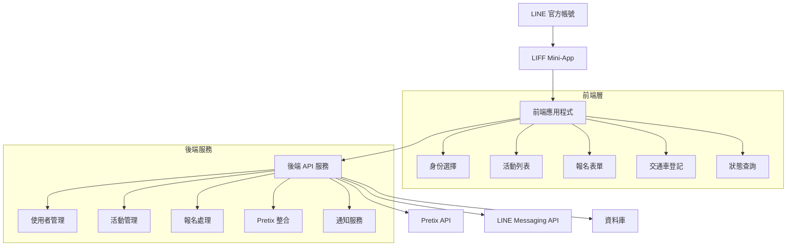
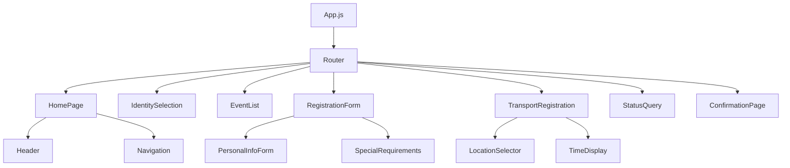

# 設計文件

## 概述

彰化供佛齋僧活動報名系統是一個基於 LINE LIFF 的 mini-app，整合 Pretix 票務系統，為法師和志工提供簡化的活動報名流程。系統採用響應式設計，優化手機使用體驗，並提供大字體和友善的使用者介面。

### 核心目標
- 簡化複雜的 Pretix 操作流程
- 提供直觀的手機端使用體驗
- 自動化資料同步至 Pretix 系統
- 整合 LINE 官方帳號生態系統

## 架構

### 系統架構圖



### 技術棧

**前端技術：**
- LIFF SDK v2.24.0 - LINE 前端框架
- Next.js 15.0.1 - React 框架
- React 18.3.1 - UI 函式庫
- CSS Modules - 樣式管理
- Axios - HTTP 客戶端

**後端技術：**
- Node.js - 執行環境
- Express.js 5.1.0 - Web 框架
- LINE Bot SDK v10.2.0 - LINE 訊息整合
- Axios - Pretix API 整合
- SQLite/PostgreSQL - 資料庫

**部署平台：**
- Netlify - 前端部署
- Heroku/Railway - 後端部署

## 元件和介面

### 前端元件架構



### 核心元件設計

#### 1. 身份選擇元件 (IdentitySelection)
```javascript
// 功能：使用者身份選擇（法師/志工）
// 狀態管理：localStorage 儲存身份資訊
// UI 特色：大按鈕設計，清楚的視覺區分
```

#### 2. 活動列表元件 (EventList)
```javascript
// 功能：顯示可報名活動，包含活動詳情和報名狀態
// 資料來源：Pretix API 透過後端代理
// 響應式設計：卡片式佈局，適應不同螢幕尺寸
```

#### 3. 報名表單元件 (RegistrationForm)
```javascript
// 功能：根據身份類型顯示對應表單欄位
// 驗證：前端即時驗證 + 後端二次驗證
// 自動填入：從 LIFF 取得的使用者資料
```

#### 4. 交通車登記元件 (TransportRegistration)
```javascript
// 功能：交通車地點選擇和時間顯示
// 即時更新：座位數量和可用狀態
// 地圖整合：顯示上車地點位置
```

### API 介面設計

#### 後端 API 端點

```javascript
// 使用者管理
GET    /api/user/profile          // 取得使用者資料
POST   /api/user/identity         // 設定使用者身份

// 活動管理
GET    /api/events                // 取得活動列表
GET    /api/events/:id            // 取得特定活動詳情
GET    /api/events/:id/transport  // 取得交通車資訊

// 報名管理
POST   /api/registration          // 提交報名資料
GET    /api/registration/:id      // 查詢報名狀態
PUT    /api/registration/:id      // 修改報名資料

// Pretix 整合
POST   /api/pretix/orders         // 建立 Pretix 訂單
GET    /api/pretix/orders/:id     // 查詢 Pretix 訂單狀態

// LINE 整合
POST   /api/line/notify           // 發送 LINE 通知
GET    /api/line/friendship       // 檢查好友狀態
```

#### Pretix API 整合

```javascript
// 主要使用的 Pretix API 端點
GET    /api/v1/organizers/{organizer}/events/
POST   /api/v1/organizers/{organizer}/events/{event}/orders/
GET    /api/v1/organizers/{organizer}/events/{event}/items/
GET    /api/v1/organizers/{organizer}/events/{event}/quotas/
```

## 資料模型

### 使用者資料模型

```javascript
const User = {
  lineUserId: String,        // LINE 使用者 ID
  displayName: String,       // 顯示名稱
  pictureUrl: String,        // 頭像 URL
  identity: String,          // 身份類型：'monk' | 'volunteer'
  phone: String,             // 聯絡電話
  emergencyContact: String,  // 緊急聯絡人（志工）
  templeName: String,        // 寺院名稱（法師）
  createdAt: Date,
  updatedAt: Date
}
```

### 活動資料模型

```javascript
const Event = {
  id: String,                // Pretix 活動 ID
  name: String,              // 活動名稱
  description: String,       // 活動描述
  startDate: Date,           // 開始時間
  endDate: Date,             // 結束時間
  location: String,          // 活動地點
  maxParticipants: Number,   // 最大參與人數
  currentParticipants: Number, // 目前報名人數
  registrationDeadline: Date, // 報名截止時間
  status: String,            // 活動狀態：'open' | 'closed' | 'full'
  pretixEventSlug: String,   // Pretix 活動代碼
  transportOptions: [TransportOption]
}
```

### 報名資料模型

```javascript
const Registration = {
  id: String,                // 報名 ID
  userId: String,            // 使用者 ID
  eventId: String,           // 活動 ID
  identity: String,          // 報名身份
  personalInfo: {
    name: String,
    phone: String,
    emergencyContact: String, // 志工專用
    templeName: String,       // 法師專用
    specialRequirements: String
  },
  transport: {
    required: Boolean,
    locationId: String,
    pickupTime: Date
  },
  pretixOrderId: String,     // Pretix 訂單 ID
  status: String,            // 報名狀態：'pending' | 'confirmed' | 'cancelled'
  createdAt: Date,
  updatedAt: Date
}
```

### 交通車資料模型

```javascript
const TransportOption = {
  id: String,
  eventId: String,
  name: String,              // 地點名稱
  address: String,           // 詳細地址
  pickupTime: Date,          // 上車時間
  maxSeats: Number,          // 最大座位數
  bookedSeats: Number,       // 已預訂座位數
  coordinates: {             // GPS 座標
    lat: Number,
    lng: Number
  }
}
```

## 錯誤處理

### 前端錯誤處理策略

```javascript
// 1. LIFF 初始化錯誤
try {
  await liff.init({ liffId: process.env.LIFF_ID });
} catch (error) {
  // 顯示友善錯誤訊息，提供重新載入選項
  showErrorMessage('系統初始化失敗，請重新載入頁面');
}

// 2. 網路連線錯誤
const handleNetworkError = (error) => {
  if (error.code === 'NETWORK_ERROR') {
    showRetryDialog('網路連線不穩定，是否重新嘗試？');
  }
};

// 3. 表單驗證錯誤
const validateForm = (data) => {
  const errors = {};
  if (!data.name) errors.name = '請輸入姓名';
  if (!data.phone) errors.phone = '請輸入聯絡電話';
  return errors;
};
```

### 後端錯誤處理

```javascript
// 統一錯誤處理中介軟體
const errorHandler = (err, req, res, next) => {
  const errorResponse = {
    success: false,
    message: err.message || '系統發生錯誤',
    code: err.code || 'INTERNAL_ERROR',
    timestamp: new Date().toISOString()
  };
  
  // 記錄錯誤日誌
  console.error('API Error:', err);
  
  res.status(err.statusCode || 500).json(errorResponse);
};

// Pretix API 錯誤處理
const handlePretixError = (error) => {
  if (error.response?.status === 400) {
    throw new Error('報名資料格式錯誤');
  } else if (error.response?.status === 403) {
    throw new Error('活動已額滿或報名已截止');
  } else {
    throw new Error('票務系統暫時無法使用，請稍後再試');
  }
};
```

## 測試策略

### 前端測試

```javascript
// 1. 單元測試 (Jest + React Testing Library)
// - 元件渲染測試
// - 使用者互動測試
// - 表單驗證測試

// 2. 整合測試
// - LIFF SDK 整合測試
// - API 呼叫測試
// - 路由導航測試

// 3. E2E 測試 (Cypress)
// - 完整報名流程測試
// - 不同身份類型測試
// - 錯誤情境測試
```

### 後端測試

```javascript
// 1. API 端點測試 (Jest + Supertest)
// - 各 API 端點功能測試
// - 權限驗證測試
// - 錯誤處理測試

// 2. Pretix 整合測試
// - Mock Pretix API 回應
// - 資料同步測試
// - 錯誤恢復測試

// 3. LINE 整合測試
// - Webhook 處理測試
// - 訊息發送測試
// - 使用者驗證測試
```

### 測試資料準備

```javascript
// 測試用的 Pretix 活動設定
const testEvent = {
  name: '測試供佛齋僧活動',
  items: [
    { name: '法師報名', category: 'monk' },
    { name: '志工報名', category: 'volunteer' }
  ],
  quotas: [
    { name: '法師名額', size: 50 },
    { name: '志工名額', size: 100 }
  ]
};

// 測試用的交通車設定
const testTransport = [
  {
    name: '彰化火車站',
    address: '彰化縣彰化市三民路1號',
    pickupTime: '07:30',
    maxSeats: 45
  },
  {
    name: '員林轉運站',
    address: '彰化縣員林市中山路二段556號',
    pickupTime: '08:00',
    maxSeats: 45
  }
];
```

## UI/UX 設計規範

### 響應式設計

```css
/* 基礎響應式斷點 */
.container {
  max-width: 100%;
  padding: 0 16px;
}

@media (min-width: 768px) {
  .container {
    max-width: 600px;
    margin: 0 auto;
  }
}

/* 大字體設計 */
.text-base {
  font-size: 18px;
  line-height: 1.6;
}

.text-large {
  font-size: 20px;
  line-height: 1.5;
}

.button {
  min-height: 48px;
  font-size: 18px;
  padding: 12px 24px;
}
```

### 色彩系統（海報風格）

```css
:root {
  /* 主色調 - 紫色系（海報背景色） */
  --primary-color: #7B4397;
  --primary-light: #A569BD;
  --primary-dark: #5B2C6F;
  --primary-gradient: linear-gradient(135deg, #7B4397 0%, #DC2430 100%);
  
  /* 強調色 - 黃金色系（海報裝飾色） */
  --accent-color: #FFD700;
  --accent-light: #FFF8DC;
  --accent-dark: #DAA520;
  
  /* 次要色 - 紅色系（海報標題區塊） */
  --secondary-color: #DC2430;
  --secondary-light: #FF6B6B;
  --secondary-dark: #B71C1C;
  
  /* 輔助色 - 藍綠色系（海報插圖元素） */
  --tertiary-color: #20B2AA;
  --tertiary-light: #7FDBDA;
  --tertiary-dark: #008B8B;
}
```

### 字體系統

```css
/* 標楷體 - 用於標題和重要文字 */
.traditional-font {
  font-family: 'DFKai-SB', '標楷體', 'Noto Serif TC', serif;
}

/* 圓潤字體 - 用於內容和說明文字 */
.rounded-font {
  font-family: 'Noto Sans TC', '微軟正黑體', 'Microsoft JhengHei', sans-serif;
}

/* 漸層文字效果 */
.gradient-text {
  background: var(--primary-gradient);
  -webkit-background-clip: text;
  -webkit-text-fill-color: transparent;
}
```

### 載入狀態設計

```javascript
// 載入動畫元件
const LoadingSpinner = () => (
  <div className="loading-container">
    <div className="spinner"></div>
    <p>載入中...</p>
  </div>
);

// 骨架屏設計
const EventListSkeleton = () => (
  <div className="skeleton-container">
    {[1, 2, 3].map(i => (
      <div key={i} className="skeleton-card">
        <div className="skeleton-title"></div>
        <div className="skeleton-text"></div>
        <div className="skeleton-button"></div>
      </div>
    ))}
  </div>
);
```

## 安全性考量

### 前端安全

```javascript
// 1. 輸入驗證和清理
const sanitizeInput = (input) => {
  return input.replace(/<script\b[^<]*(?:(?!<\/script>)<[^<]*)*<\/script>/gi, '');
};

// 2. LIFF 權限管理
const checkLiffPermissions = async () => {
  const requiredScopes = ['profile', 'openid'];
  const grantedScopes = await liff.permission.getGrantedAll();
  
  const missingScopes = requiredScopes.filter(
    scope => !grantedScopes.includes(scope)
  );
  
  if (missingScopes.length > 0) {
    await liff.permission.requestAll();
  }
};
```

### 後端安全

```javascript
// 1. LINE 使用者驗證
const verifyLineUser = async (accessToken) => {
  try {
    const response = await axios.get('https://api.line.me/v2/profile', {
      headers: { Authorization: `Bearer ${accessToken}` }
    });
    return response.data;
  } catch (error) {
    throw new Error('無效的 LINE 存取權杖');
  }
};

// 2. Pretix API 金鑰保護
const pretixConfig = {
  baseURL: process.env.PRETIX_API_URL,
  headers: {
    'Authorization': `Token ${process.env.PRETIX_API_TOKEN}`,
    'Content-Type': 'application/json'
  }
};

// 3. 資料驗證中介軟體
const validateRegistration = (req, res, next) => {
  const { name, phone, identity } = req.body;
  
  if (!name || !phone || !identity) {
    return res.status(400).json({
      success: false,
      message: '必填欄位不完整'
    });
  }
  
  next();
};
```

## 部署和維運

### 環境變數設定

```bash
# 前端環境變數 (.env.local)
NEXT_PUBLIC_LIFF_ID=your_liff_id
NEXT_PUBLIC_API_BASE_URL=https://your-api.herokuapp.com
NEXT_PUBLIC_LINE_CHANNEL_ID=your_channel_id

# 後端環境變數
LINE_CHANNEL_ACCESS_TOKEN=your_channel_access_token
LINE_CHANNEL_SECRET=your_channel_secret
PRETIX_API_URL=https://your-pretix-instance.com/api/v1
PRETIX_API_TOKEN=your_pretix_api_token
PRETIX_ORGANIZER_SLUG=your_organizer_slug
DATABASE_URL=your_database_url
```

### 部署流程

```yaml
# Netlify 部署設定 (netlify.toml)
[build]
  command = "cd src/nextjs && npm run build"
  publish = "src/nextjs/.next"

[build.environment]
  NODE_VERSION = "18"

[[redirects]]
  from = "/api/*"
  to = "https://your-backend.herokuapp.com/api/:splat"
  status = 200
```

### 監控和日誌

```javascript
// 錯誤追蹤
const logError = (error, context) => {
  console.error('Application Error:', {
    message: error.message,
    stack: error.stack,
    context,
    timestamp: new Date().toISOString(),
    userAgent: navigator.userAgent
  });
  
  // 發送到錯誤追蹤服務
  if (process.env.NODE_ENV === 'production') {
    // Sentry.captureException(error);
  }
};

// 效能監控
const trackPerformance = (action, duration) => {
  console.log('Performance:', {
    action,
    duration,
    timestamp: new Date().toISOString()
  });
};
```